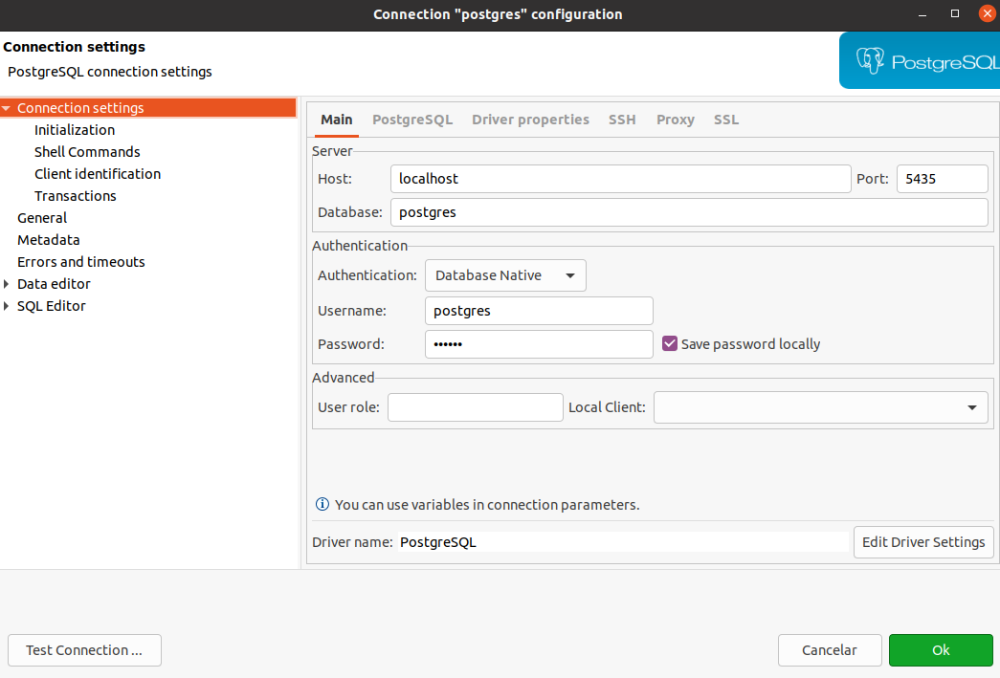

# Project Quarkus-Estudos 

Este projeto visa estudar e aprender mais sobre a ferramenta Quarkus

## Executando o aplicativo no modo dev

Você pode executar seu aplicativo no modo dev que permite a codificação ao vivo usando:
```shell script
./mvnw compile quarkus:dev
```

- Rodando em: 
http://localhost:8080/q/dev/.

<br/>

## Empacotando e executando o aplicativo

O aplicativo pode ser empacotado ao usar:
```shell script
./mvnw package
```
Ele produz o arquivo quarkus-run.jar no diretório

<br/>

### Extensões do nosso projeto:

    -quarkus-hibernate-orm-panache  
    -quarkus-jdbc-postgresql  
    -quarkus-resteasy-jackson  

<br/>
<br/>

Para conectar com um DB, vamos utilizar imagem docker de Postgres:

    docker run -d -i -t -p5435:5432 -ePOSTGRES_PASSWORD=123456 postgres:13  

Abrimos o DBeaver para realizar a conexão:



-hots = localhost  
-porta = 5435  
-database = postgres  
-username = postgres  
-senha = 123456  